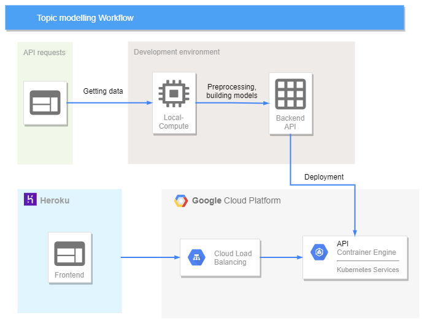

# Topic modeling

This project uses Natural Language Processing and Machine Learning methods to achieve multi-class classification problem. 

## 🔑 Method
In this project, I use approximately ten-thousand descriptions of podcasts broadcasting in *Spotify* which are obtained by API. Together with their associated label acquired from Spotify's search engine API, the data is used to trained the models to classify the label from text. All the labels are pre-defined by me, currently 10 classes, including `["machine learning", "cooking", "crime", "politics", "kid", "comedy", "sport", "culture", "lifestyle", "business"]`.

Once the models are done, the API will be created and deployed to serve models as a service. Then I create a simple web interface for user to interact with models. After that, the web interface will be deployed to public. Figure below depicts workflow and architecture of this project.

## 📘 Notes
- **Mask out timestamps**: a lot of descriptions contain timestamps so it's not make sense to tokenize these timestamps. Should we mask them as `[TIME]` or `[UNK]` ?.
  
  
## 📑 Action plan
1. **Preparing data**
    - **Getting data from Spotify API** ✅
      - Ingest data into `.json`  then tabulate into `.csv`
      - Artifact : 
        1. `included.txt` : log for raw data that is in conditions
        2. `excluded.txt` : log for raw data that is not in conditions 
        3. `failed_ep_query.txt` : log for failed API calls
        4. `total_df.csv` : resulting table containing infomation useful for analysis
    - **Cleansing data** ✅
      - Drop duplicated and missing values
      - Mask url as `[UNK]` token
      - Artifact :
        1. `df_notnull_notdup.csv` : cleansed version of `total_df.csv`
    - **Text preprocessing** 🔜
      - Does preprocessing the text can improve the model's performance ?
2. **Building model**
    - Without text preprocessing
        |     Model     |               Method              | Status | Overall accuracy on test data|
        |:-------------:|:---------------------------------:|:------:|:----------------:|
        |    Baseline   |         Sklearn estimators        |    ✅   |        50%       |
        | Deep Learning |   Sequential's Tensorflow model   |    ✅   |        70%       |
        |  Transformer  | Fine tune pre-trained HuggingFace |    ✅   |        85%       |
    - With text preprocessing 🔜
3. **Create backend API** to serve `model_2` and `pre-trained` as a service (using *FastAPI*)
    - **APIs** 
      - Recieve a sentence and return predicted probabilities of each class ✅
    - **Testing** 
      - Tested usability with Postman ✅
      - Automated testing 🔜
    - **Deploy backend** as Microservice
      - Build Docker image ✅
      - Deploy on Google Kubernetes Engine ✅

4. **Create web frontend** as a user's interface to API
    - For web interface, it will be created in another project as I intended to build this project in the Microservice style. 
      - Web interface using *Dash* deployed on Heroku✅: https://topicmodelling-dash.herokuapp.com/

    
## 📍 Acknowledgement
- All the datasets, log files, and models are not included in this repository because of their sizes.
- The data used in this project is heavily rely on Spotify search API which is, In my opinion, quite reliable.

## 📈 Further improvement
- In this project, I used around 10k datapoints which is not to much for NLP problems. So, the main improvement I can think of is to query more data.
- In addition to query more data only from Spotify, we could use data from other sources as well. Doing so will hopefully improve models' generalizability. 
- We could expand the target classes by acquring more data to make models be able to classify whichever topic we want. In this project, I used 10 topics mentioned above because they're general and easy to think of.
- We could try fine-tunnig other pre-trained models. I selected *Distilled BERT* because it's lightweight.